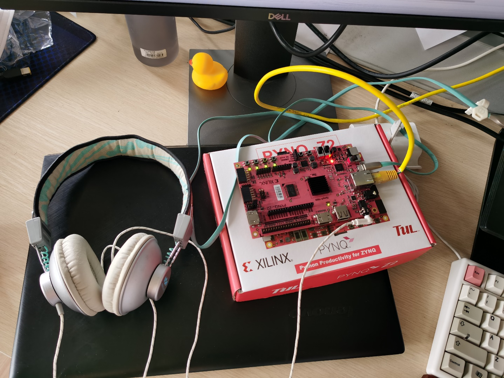
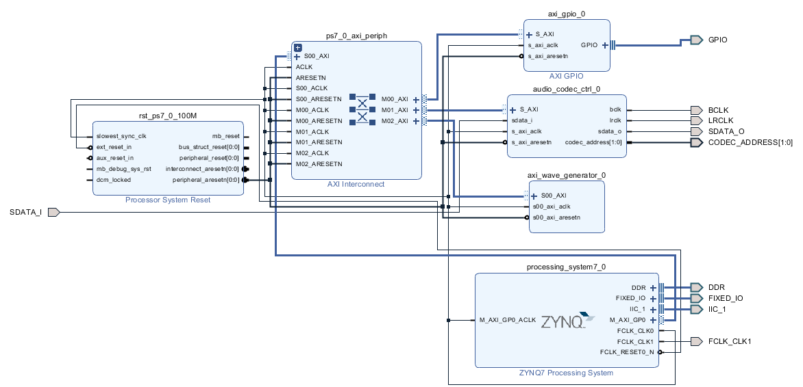

2020年新工科联盟-Xilinx暑期学校（Summer School）
项目名称：8bit声卡
项目概要：本项目为基于PYNQ-z2的8bits音乐生成，旨在通过多核异构框架的开发板生成一段8-bit音乐并输出到耳机接口通过扬声器/耳机等外设播放。
使用工具：vivado2018.3 、vivado HLS 、SDK。
队员：	石昊	20BS057A 	华东师范大学
	张永智	20BO216A 	黑龙江大学
	黎炜桁	20BO041A 	北京大学
	陆方正	20BO212A 	重庆大学

卡板型号：PYNQ-Z2
仓库目录：zhangyongzhi/Xilinx_Find_Fish_Team 目录内为本次项目文件压缩包

压缩包内：
sourcecode为源代码，其中的wave_generator是工程文件压缩包。
images为图片。
ExecutableFiles内为bit流文件。

    

    <i>system picture</i>

    

    <i>Vivado Block Design</i>

